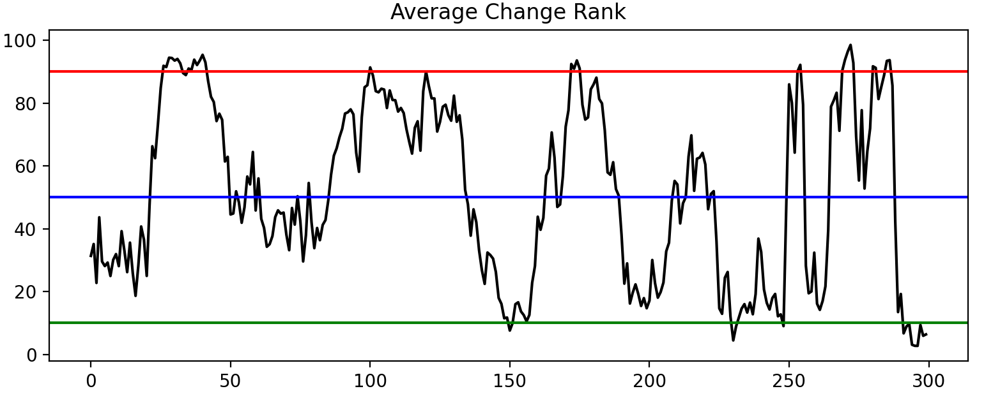
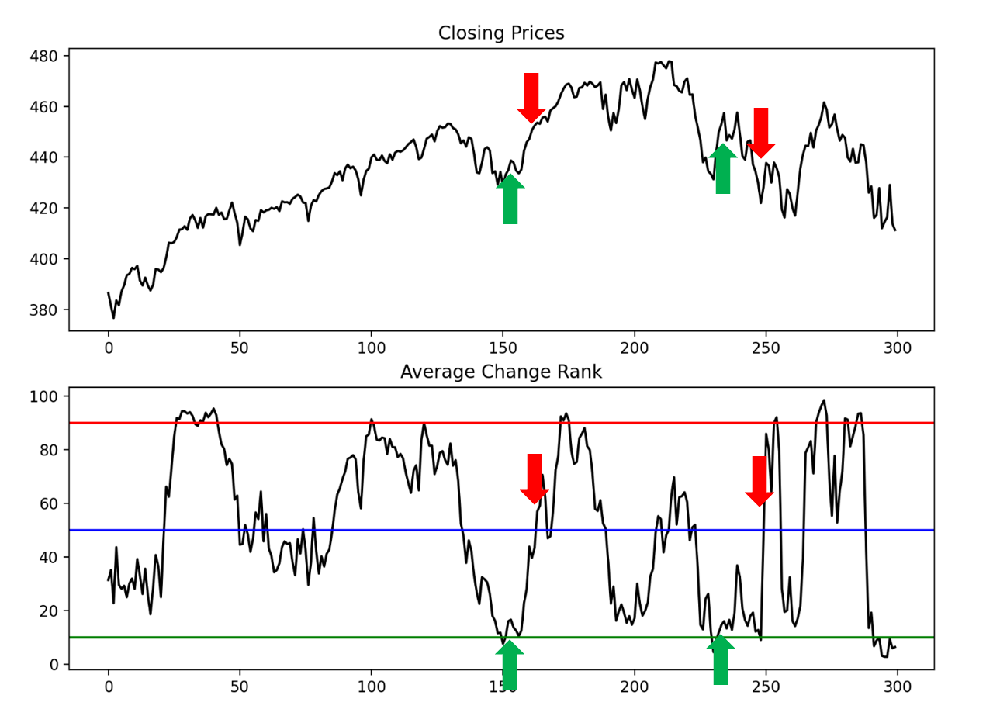
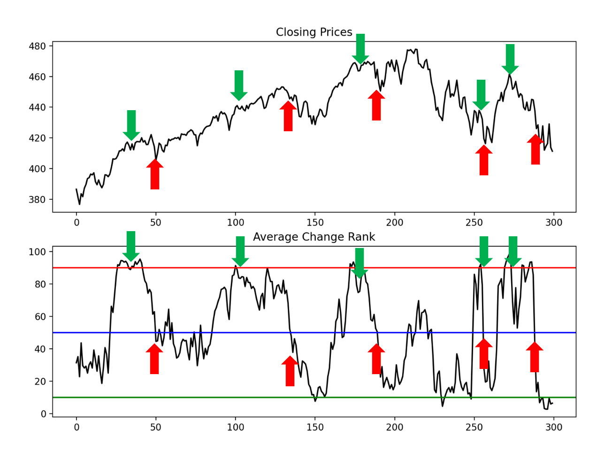

# **Average Change Rank (ACR) Indicator By Rohit Tripathy**

## **Contents**
- **Preview of the ACR Indicator**
  - Period
  - High Threshold
  - Low Threshold
  - Mid-line
  

- **How ACR is Calculated**
  - Calculating Change
  - Calculating Average Change
  - Calculating Average Change Rank
  

- **Using the ACR Indicator**
  - Mean Reversion
  - Entry and Exit signals for Long Positions
  - Entry and Exit Signal for Short Positions
  - Using the ACR Yourself
  

---

## **Preview of the ACR Indicator**

This is an example of what the ACR indicator looks like.
This is the 24-Period ACR for SPY on the daily chart

 - **Period:** This is the amount the candlesticks that are used to calculate the average change rank.

 - **High Threshold:** This is set to 90, but can be set to any desired number. The numbers on the y axis determine the percentile for the current candle's average change. A value above the high threshold means that the current average change is relatively high.

 - **Low Threshold:** This is set to 10, but can be set to any desired number. A value below the low threshold means that the current average change is relatively low.

 - **Mid-line:** This is set to 50, and should not  be adjusted. A value at the mid-line means that the current average change is exepcted. 

---

## **How ACR is Calculated**

- **Calculating the Change of a Stock**
  - I define this as the percentage difference between the open and close price. If the open price was $100 per share and the closing price was $105, the change would be 5%.
  

- **Calculating the Average Change**
  - The period defines how many candlesticks' changes we use when finding the average change. 
  - Let's suppose the changes for the last 5 candles were 1.0%, 2.0%, 3.0%, 4.0%, and 5.0%. If we were to use a period of 5, the average change for the most recent day would be 3% (average of 5 candles).
  - If we were to use a period of 3, the average change for the most recent day would be 4% (average of candles). The previous day's average change would be 3% (average of 4.0, 3.0, and 2.0).
  

- **Calculating the Average Change Rank**
  - Once we have determined each day's average change based on the specified period, we can convert all the average changes into percentiles, thus obtaining each candle's average change rank.
  - This is useful because it allows us to see whether a day's average change is abnormally low or high. If we didn't compute percentiles, it would be harder to compare different average changes.
  

---

## **Using the ACR Indicator**

- **Mean Reversion**
  - Mean reversion is a theory that assumes that an asset's returns will revert back to average levels over time.
  - For this indicator, I will be using the median as a central measure of tendency as opposed to the mean (hence the mid-line at the 50th percentile). This is because medians aren't severely affected by potential outliers such as earnings reports.
  

- **Entry and Exit for Long Positions**
  - A good point to enter a long position is when the ACR breaks above the low threshhold. A break above the low threshold serves as confirmation that the ACR will revert back to the mid-line.
  - One should exit a long position once the ACR has either touched or broken above the mid-line.
  - Here is an example of good entry and exit points for long positions.
  

  

- **Entry and Exit for Short Positions**
  - A good entry point for a short position is when the ACR breaks below the high threshhold. A break below the high threshold serves as confirmation that the ACR will revert back to the mid-line.
  - One should exit their short position once the ACR has either touched or broken below the mid-line.
  - Here is an example of good entry and exit points for short positions.
      
    
      

- **Using the ACR Yourself**
  - Feel fre to look into the Jupyter Notebook I put along with this project. You can tweak the numbers yourself and see what works best for you!
